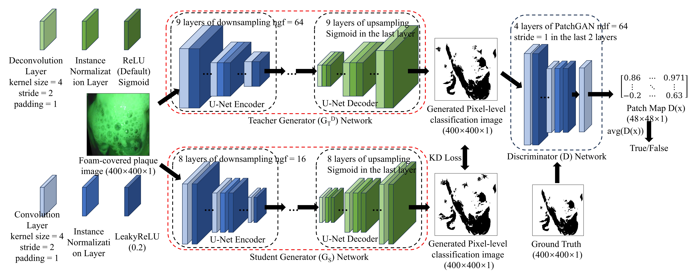

# PIT: A Novel Toothbrush Providing Real-Time and Robust Plaque Indication During Brushing



## Overview

This repository contains the source code for the Plaque Indication Toothbrush (PIT), a novel system designed to provide real-time plaque visualization during toothbrushing, as presented in the paper *PIT: A Novel Toothbrush Providing Real-Time and Robust Plaque Indication During Brushing* (MobiSys ’25, June 23–27, 2025, Anaheim, CA, USA). The PIT system integrates a micro-camera, green LEDs, and a deep learning model to achieve robust plaque segmentation under toothpaste foam, enabling effective plaque removal.

The code implements a GAN-based U-Net model with knowledge distillation for efficient plaque segmentation, achieving an IoU of 75.22% and a latency of 29 ms on a Xiaomi 14 Ultra smartphone. For detailed methodology, hardware design, and evaluation results, please refer to the paper: [PIT Paper](https://doi.org/10.1145/3711875.3729124).

## Repository Structure

- `data_loader.py`: Custom PyTorch Dataset and DataLoader for loading dental images and corresponding plaque masks.
- `loss.py`: Loss functions for adversarial training, knowledge distillation, and evaluation (SSIM, feature, style, total variation, and L1 losses).
- `main.py`: Main script to orchestrate training and testing of the teacher and student models.
- `metrics.py`: Implementation of the Dice score metric for evaluating segmentation performance.
- `train.py`: Training scripts for the teacher (GAN-based) and student (distilled) models.
- `model.py`: Definitions of the Teacher U-Net, Student U-Net, and PatchGAN discriminator models.

## Prerequisites

- Python 3.8+
- PyTorch 1.9+
- Torchvision
- Torchmetrics
- PIL (Python Imaging Library)
- NVIDIA GPU (optional, for faster training; CPU supported)

Install dependencies using:

```bash
pip install torch torchvision torchmetrics pillow
```

## Usage

1. **Clone the Repository**:
   ```bash
   git clone https://github.com/markmochi200/PIT.git
   cd PIT
   ```

2. **Prepare Data**:
   Due to privacy concerns related to human subject data, the dataset used in the paper is not publicly available. The dataset consists of images captured by the PIT toothbrush and corresponding ground truth plaque masks. For details on dataset creation, refer to Section 5.1 of the paper.

3. **Directory Structure**:
   Organize your dataset (if you have compatible data) as follows:
   ```
   Dataset_UNet/
   ├── train/
   │   ├── images/
   │   │   ├── 1.png
   │   │   ├── 2.png
   │   │   └── ...
   │   ├── masks/
   │   │   ├── 1_label.png
   │   │   ├── 2_label.png
   │   │   └── ...
   ```

4. **Train the Models**:
   - Update the `image_dir` and `mask_dir` paths in `main.py` to point to your dataset.
   - Run the training script:
     ```bash
     python main.py
     ```
   - The script trains the teacher model (GAN-based U-Net), saves it as `teacher_model.pth`, then trains the student model (distilled U-Net) and saves it as `student_model.pth`.

5. **Test the Models**:
   - The `main.py` script automatically tests both models after training, reporting the mean Dice score.
   - To test a pre-trained model separately:
     ```python
     from test import test_model
     from model import StudentUNet
     import torch
     model = StudentUNet().to(device)
     model.load_state_dict(torch.load("path/to/your/student_model.pth"))
     test_model(model, test_loader, device)
     ```

## Model Details

- **Teacher U-Net**: A deep U-Net model trained with adversarial and L1 losses for high-accuracy plaque segmentation.
- **Student U-Net**: A lightweight U-Net model distilled from the teacher model for real-time inference on mobile devices.
- **PatchGAN Discriminator**: Used during teacher model training to enhance segmentation quality via adversarial loss.

## Dataset Availability

Due to privacy concerns involving human subjects, the dataset used for training and evaluating the PIT system is not publicly available. For details on the dataset collection process, including the use of denture models and simulated plaque, refer to Section 5.1 of the paper.

## Citation

If you use this code or the PIT system in your research, please cite:

```bibtex
@inproceedings{chen2025pit,
  title={PIT: A Novel Toothbrush Providing Real-Time and Robust Plaque Indication During Brushing},
  author={Chen, Kaixin and Xiang, Junfan and Tan, Wanying and Chen, Keyu and Luo, Yaqiong and Ma, Chang and Wu, Kaishun and Wang, Lu},
  booktitle={Proceedings of the 23rd Annual International Conference on Mobile Systems, Applications and Services},
  pages={15--27},
  year={2025}
}
```

## Contact

For issues or inquiries related to the code, please contact Junfan (Mark) Xiang at [junfanxiang@gmail.com](mailto:junfanxiang@gmail.com) or start an issue on this repository.

## License

This project is licensed under the [Creative Commons Attribution 4.0 International License](http://creativecommons.org/licenses/by/4.0/). See the [LICENSE](LICENSE.md) file for details.